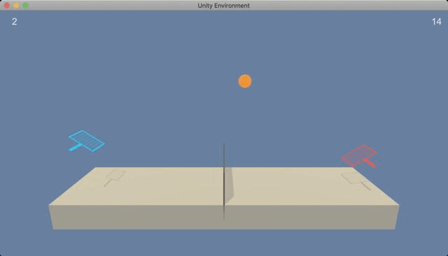

# Project3 - Multi-Agent Collaboration & Competition (Udacity DRLND)
This is a project that trains two agents that can play tennis. ([details](https://github.com/udacity/deep-reinforcement-learning/tree/master/p3_collab-compet))



## Requirements
1. Download the environment from one of the links below.  You need only select the environment that matches your operating system:
    - Linux: [click here](https://s3-us-west-1.amazonaws.com/udacity-drlnd/P3/Tennis/Tennis_Linux.zip)
    - Mac OSX: [click here](https://s3-us-west-1.amazonaws.com/udacity-drlnd/P3/Tennis/Tennis.app.zip)
    - Windows (32-bit): [click here](https://s3-us-west-1.amazonaws.com/udacity-drlnd/P3/Tennis/Tennis_Windows_x86.zip)
    - Windows (64-bit): [click here](https://s3-us-west-1.amazonaws.com/udacity-drlnd/P3/Tennis/Tennis_Windows_x86_64.zip)
    
    (_For Windows users_) Check out [this link](https://support.microsoft.com/en-us/help/827218/how-to-determine-whether-a-computer-is-running-a-32-bit-version-or-64) if you need help with determining if your computer is running a 32-bit version or 64-bit version of the Windows operating system.

    (_For AWS_) If you'd like to train the agent on AWS (and have not [enabled a virtual screen](https://github.com/Unity-Technologies/ml-agents/blob/master/docs/Training-on-Amazon-Web-Service.md)), then please use [this link](https://s3-us-west-1.amazonaws.com/udacity-drlnd/P3/Tennis/Tennis_Linux_NoVis.zip) to obtain the "headless" version of the environment.  You will **not** be able to watch the agent without enabling a virtual screen, but you will be able to train the agent.  (_To watch the agent, you should follow the instructions to [enable a virtual screen](https://github.com/Unity-Technologies/ml-agents/blob/master/docs/Training-on-Amazon-Web-Service.md), and then download the environment for the **Linux** operating system above._)

2. Place the file in the DRLND GitHub repository, in the `p3_collab-compet/` folder, and unzip (or decompress) the file. 
3. Packages
    - torch==1.4.0
    - unityagents==0.4.0
    - numpy==1.18.1

## Getting Started
# Report

## 1. Folder Tree
**Report.ipynb** - Describing the algorithm of Multi-Agent DDPG(MADDPG) for solving the "Tennis" task.

**main.ipynb** - Containing the training code of the MADDPG algorithm and showing the return of each episode along the 
training step.

**model.py&utils.py** - Containing the network architechture

**MADDPG.ckpt** - The trained model weights.

**MADDPG_max_scores.csv** - results.

## 2. Approach
Due to the fact that it is often unstable to train multiple agent in a environment. I implement the MADDPG algorithm that partly solve this problem. MADDPG is extended from the DDPG algorithm, and constructed by Actor-Critic architecture. The diffrence between them is use the so called "decentralized actor" with the "centralized critic", which better fit the multi agent problem, see figure below.


Next, I will discussed my implementation of this algorithm.

### 2.1 Actor-Critic
First, I create two decentralized actor and a centralized critic along with their target networks for two agent. The code can be found in "Agent" class of model.py.
```python
        self.actor_local_0 = Actor(state_size, action_size, embed_dim, seed).to(
            device)
        self.actor_target_0 = Actor(state_size, action_size, embed_dim, seed).to(
            device)
        self.actor_optimizer_0 = optim.Adam(self.actor_local_0.parameters(), lr=lr)

        self.actor_local_1 = Actor(state_size, action_size, embed_dim, seed).to(
            device)
        self.actor_target_1 = Actor(state_size, action_size, embed_dim, seed).to(
            device)
        self.actor_optimizer_1 = optim.Adam(self.actor_local_1.parameters(), lr=lr)

        self.critic_local = Critic(2 * state_size, 2 * action_size, embed_dim, seed).to(
            device)
        self.critic_target = Critic(2 * state_size, 2 * action_size, embed_dim, seed).to(
            device)
        self.critic_optimizer = optim.Adam(self.critic_local.parameters(), lr=lr)
```

### 2.2 Time-Correlated Replay Buffer
In the last two project, we often save one step experience like (S, A, R, S') to the replay buffer, and then randomly sample a batch from the replay buffer to train the agent. This implementation may suit for one-step TD update algorithm. However, whatif we want to implement n-step TD($\gamma$) algorithm to better trade off the bias and variance of the estamation of the Q value. So in my case, I implement a time-correlated replay buffer, which imply that the agent save a continuous episode at a time in the replay buffer, and then sample the whole experiences at the training time to train the model. Note, in my implementation, I find it is good enough to train the model using one-step TD learning, so n-step TD learning can be the future work, which may perform better.

### 2.3 Hyperparameters

#### Ornstein-Uhlenbeck Process
I addressed the exploration and exploitation dilemma using the Ornstein-Uhlenbeck process, which add a certain noise to the action at each timestep. The characteristic of the OU process is that its noise is dependent on the previous timestep, which is infected by three parameters:

1) $\mu$: the long-running mean. Default: 0

2) $\theta$: the speed of mean reversion. Default: 0.15

3) $\sigma$: the volatility parameter. Default: 0.2

Furthermore, we linearly decay the noise for more exploitation and less exploration throungh the training process. 

```python
EPS_START = 5.0   # initial value for epsilon in noise decay process in Agent.act()
EPS_EP_END = 500  # episode to end the noise decay process
EPS_FINAL = 0     # final value for epsilon after decay
```
#### Other Hyperparameters
```python
BATCH_SIZE = 16         # Batch size of training samples.
EMBED_DIM = 256         # Embed size of the agent.
NUM_EPISODES = 2500     # Maximum training episodes.
LOG_INTERVAL = 128      # The interval to print the average scores
LEARN_NUM = 16          # Learning times at each episode.
BUFFER_SIZE = int(1e6)  # The buffer size of the replay buffer.
```

## Experimental Results


From the figure, we can see that our agent accomplished an average score of 1.60. And it first hit an average score of +0.5 at around 2000 episodes. To this end, we solve this task!